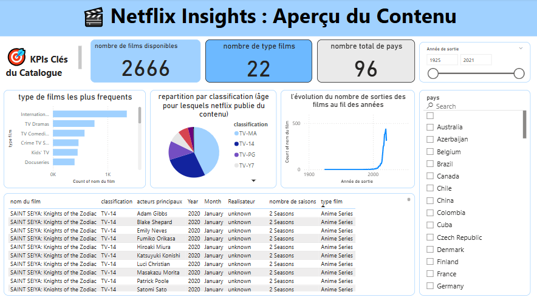

# 📊 Netflix Insights - Tableau de Bord Power BI

Ce projet a pour objectif d'explorer et d'analyser le **catalogue de Netflix** à l'aide d'un **tableau de bord interactif Power BI**, basé sur un jeu de données public de Kaggle.

## 🎯 Objectif

Fournir un aperçu visuel et interactif du contenu Netflix films , permettant à l'utilisateur d’explorer les données selon plusieurs critères :
- Type de contenu
- Classification d’âge
- Pays de production
- Année de sortie
- Acteurs, réalisateurs et types films

---

## 📁 Dataset

- **Source** : [Kaggle Netflix Dataset](https://www.kaggle.com/datasets/shivamb/netflix-shows?resource=download)
- **Fichier utilisé** : `netflix_titles.csv`

---

## 🧼 Étapes de Nettoyage des Données (Power Query)

Le nettoyage a été réalisé directement dans **Power BI via Power Query**, en suivant les étapes ci-dessous :

### ✅ Traitement des données :
- **Suppression** des lignes vides ou incomplètes (nulls importants)
- **Nettoyage** de la colonne `date_added` → transformation en format date + extraction du mois
- **Séparation** de la colonne `duration` en deux colonnes :
  - `duration_value` : valeur numérique
  - `duration_unit` : unité (minutes ou saisons)
- **Standardisation** des colonnes texte (`title`, `cast`, `country`, etc.)
- **Séparation** des genres (`listed_in`) par ligne (optionnel mais utile pour l’analyse par type de contenu)
- **traduction** des donnees en francais pour plus de comprehension
---

## 📌 KPIs Créés

- Nombre total de films Netflix disponibles
- Nombre de types films de contenus différents
- Nombre total de pays représentés

---

## 📊 Visualisations incluses dans le tableau de bord

- **Histogramme** des types films les plus frequents les plus fréquents
- **Camembert** de la classification par âge
- **Courbe** d’évolution du nombre de sorties des films par année
- **Filtres dynamiques** : année, pays

---

## 🔍 Interactivité

- Barre de recherche sur le nom du pays
- Filtres dynamiques par pays, année 
- Table dynamique : titre, classification, acteurs, réalisateur, type de film, nombre de saisons

---

## 💡 Ce que j’ai appris

- Nettoyage de données avec Power Query
- Structuration d’un tableau de bord clair et utile
- Création de KPIs et visualisations pertinentes
- Amélioration de la lisibilité et de l'interactivité sur Power BI

---

## 🖼️ Aperçu du Dashboard

---

## 🧠 Auteur

- **Nom** : *OUSSEIN IBRAHIM*
- **LinkedIn** : [Ton profil LinkedIn](https://www.linkedin.com/in/oussein-ibrahim-0a0883339)

